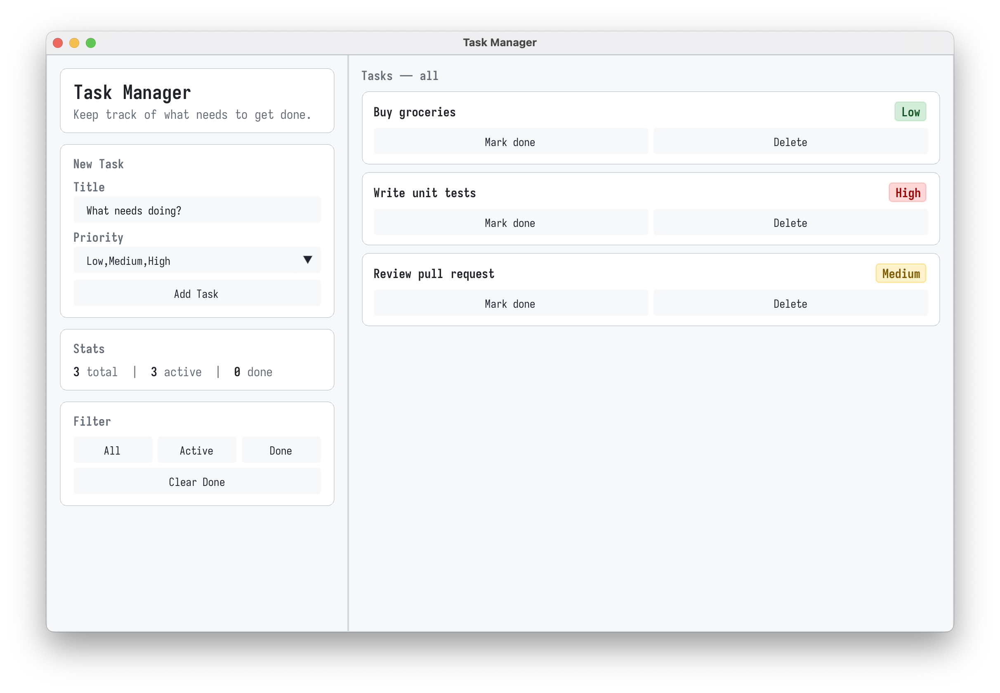
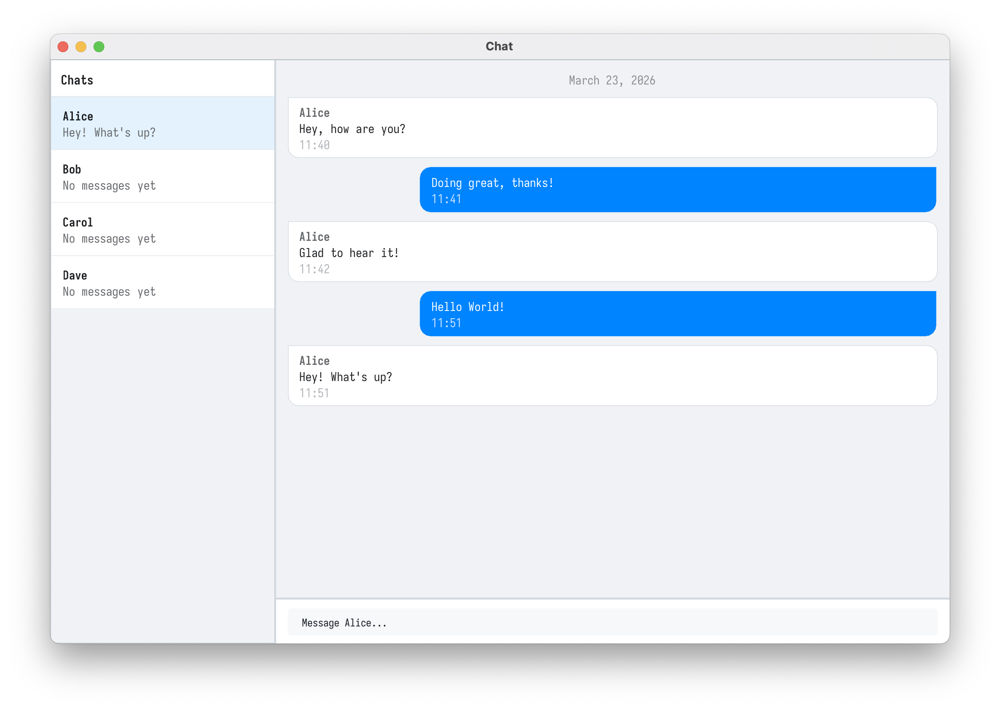
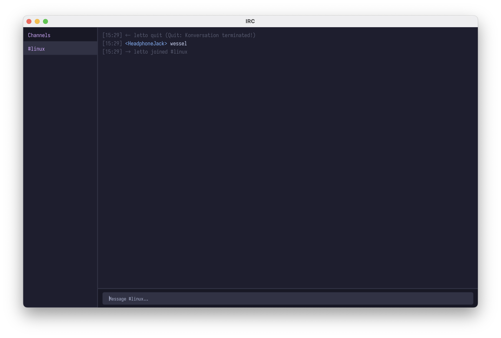

<p align="center">
    
</p>

---

<p align="center">
<i>An experimental lightweight language-agnostic cross-platform UI library</i>
</p>

StdUI is a **lightweight cross-platform UI library** that can be used with any programming language. It's designed to be spawned as process and communicate with the main application via stdin/stdout. This allows for easy integration with various programming languages and frameworks. It supports a reduced sub-set of HTML/CSS for UI rendering. **No browser is involved.**

> [!WARNING]
> This project is experimental. Expect bugs, missing features and breaking changes. The API is not stable and may change without deprecation. Use at your own risk.

## Features

- Cross-platform (Windows, macOS, Linux)
- Language agnostic (communicates via stdin/stdout)
- Supports a reduced sub-set of HTML/CSS for UI layouting and styling
- Pane-based layout system
- Interactive widgets:
  - Buttons
  - Text/Number/Password inputs
  - Checkboxes
  - Sliders
  - Progress bars
  - Color Picker
- Display of images via `img` tag
- Native file/folder dialogs
- Supports playing of sounds
- Clipboard text access
- Notification toasts
- ~5MB binary size
- ...

## Examples

- [Todo List](./example/todo): Simple todo list app
- [Chat](./example/chat): Simple chat interface with message input and display (no real networking, just simulates a conversation)
- [Simple Example](./example/simple): Minimal example just showing the StdUI logo and a button
- [IRC Client](./example/irc): A working, but simple IRC client

All these examples are based on the Go SDK.

## Limitations

This uses litehtml for html/css layouting. This means that only a reduced sub-set of HTML/CSS is supported and there are quirks in the way some html/css is interpreted. For example, the `display: flex` property is suported, but `gap` is not. Sometimes you might need to fall back to `table` layout to achieve the desired result or use some other slightly strange workarounds.

## Usage

stdui is a **compiled C++ binary** that opens a native OS window and renders HTML with interactive widgets. Your application controls it by spawning it as a child process and exchanging **newline-delimited JSON** over stdin/stdout. Any language that can start a process and read/write pipes can drive it.

```
Your App (Go, Python, anything)
        │  stdin  → JSON commands
        │  stdout ← JSON events
        ▼
   stdui binary (C++)
   ┌──────────────────────────────┐
   │  litehtml  — HTML/CSS layout │
   │  ImGui     — interactive     │
   │             widgets          │
   │  raylib    — window, audio   │
   └──────────────────────────────┘
```

### Startup

The binary blocks on startup waiting for a `settings` message. Send it immediately after spawning the process, before doing anything else:

```json
{ "action": "settings", "data": { "title": "My App", "windowWidth": 800, "windowHeight": 600 } }
```

Once the window is open and ready, the binary replies:

```json
{ "action": "ready" }
```

Only send content after you receive `ready`.

### Rendering

Push HTML to the window with `update-content`. The binary re-renders immediately:

```json
{ "action": "update-content", "data": "<h1>Hello from stdui</h1>" }
```

Whenever your state changes, build a new HTML string and send another `update-content`. There is no incremental patching — just replace the whole thing.

### Interactive Widgets

Standard HTML/CSS handles layout and styling. For interactive elements, use the built-in `<ui-*>` tags:

```html
<ui-button text="Save" action="save"></ui-button>
<ui-input id="name" type="text" placeholder="Your name" value=""></ui-input>
<ui-select id="theme" options="Light|Dark|System" value="Light"></ui-select>
<ui-slider id="vol" min="0" max="1" value="0.5"></ui-slider>
<ui-checkbox id="notify" label="Enable notifications" checked="false"></ui-checkbox>
```

When the user interacts with one of these, the binary emits an event on stdout.

### Events

A button click:

```json
{ "action": "button-clicked", "data": { "action": "save", "text": "Save", "pane": "main" } }
```

An input or widget value change:

```json
{ "action": "input-changed", "data": { "id": "name", "value": "Alice", "pane": "main" } }
```

A link click (`<a href="...">`):

```json
{ "action": "url-clicked", "data": { "url": "my-app://some-route", "pane": "main" } }
```

Window closed by the user:

```json
{ "action": "window-closed" }
```

Read these lines from stdout in a loop, parse the JSON, and react however your app needs to.

### Minimal Round-Trip

```
You → stdui   {"action":"settings","data":{"title":"Hello","windowWidth":400,"windowHeight":300}}
stdui → You   {"action":"ready"}
You → stdui   {"action":"update-content","data":"<h1>Hi</h1><ui-button text=\"Click me\" action=\"hi\"></ui-button>"}
  ... user clicks the button ...
stdui → You   {"action":"button-clicked","data":{"action":"hi","text":"Click me","pane":"main"}}
You → stdui   {"action":"update-content","data":"<h1>You clicked it!</h1>"}
  ... user closes the window ...
stdui → You   {"action":"window-closed"}
```

That's the entire model. Every interaction follows this same pattern: send action, receive events, send new action.

**You can learn more about the protocol in the [protocol specification](./PROTOCOL.md).**

## SDKs

### Go

A Go SDK is available in the `sdk/go` directory. It provides a simple API for communicating with the StdUI process and reacting to user interactions. Usage examples can be found in the `./example` folder. To install the Go SDK, run:

```
go get github.com/BigJk/stdui/sdk/go@latest
```

```go
import stdui "github.com/BigJk/stdui/sdk/go"
```

## Screenshots

<p align="center">
    
</p>

<p align="center">
    
</p>

<p align="center">
    
</p>

## Found the project useful? :smiling_face_with_three_hearts:

[](https://ko-fi.com/A0A763FPT)
